# Existentialism vs The Law of Attraction - Belief Systems Impact on Mental Health

----

## Motivation

> Existentialism is killing me. What started out as a spiritual journey has now completely left me broken. Okay so I’m terrified of mortality and death. But I’m not a simple case, I think I might have some form of ocd. I keep looking at the world around me and feeling this horrible dread. “Is this a simulation game?” “Am I in hell, is god evil?” “What is all this”.

 

This was posted on *r/Existentialism* in October, 2022. The author is one among many on the subreddit that subscribes to *Friedrich Nietzsche*’s philosophy of *Existentialism*. The gist of the Existential mindset is that life is meaningless, so we can make up our own meaning. Taking this one step further, an analytical mind is forced to ask, **“Why live at all then? Life is uncomfortable afterall.”** It is an observation that regular people don’t actively think about the meaning of life and get an existential crisis. On the other hand, one cursory glance at this particular subreddit is enough to give the reader an idea that the majority of posts revolve around the concept of **“suicide as a result of meaninglessness.”** 

 

This led me to investigate the effect of mental health problems as a result of belief systems such as the one above. Existentialism is based on observed reality. There are a number of philosophies in the spiritual domain that don’t always have roots in (commonly) observed reality, such as *New Age, Law of Attraction, or Vedantic philosophies*. I wanted to compare the impacts of belief systems on reddit users who post in one or more of mental health subreddits such as *SuicideWatch, BPD,* etc. and observe any general differences between two vastly different philosophies. For this purpose, I chose **r/Nietzsche** representing *Existentialism* and **r/NevilleGoddard** representing *Law of Attraction*. *Law of Attraction* is a new age philosophy popularized in the book *The Secret*. The gist of this philosophy is that you attract your life’s experiences by the thoughts you think. In my opinion, this stands in stark contrast to Existentialism, and hence, I chose this for comparison. Ultimately, this project will shed some light on the question, **“Which belief system promotes mental health?”**

 

----

 

## Procedure

I scraped *Reddit* using **Pushshift.io** API. I found all the authors who have posted in either of the philosophy subreddits and also in any of mental health subreddits. Then I scrape all the posts and comments made by these authors and run a comparison between them. Turns out that authors that post in either of these philosophy subreddits are mutually exclusive.

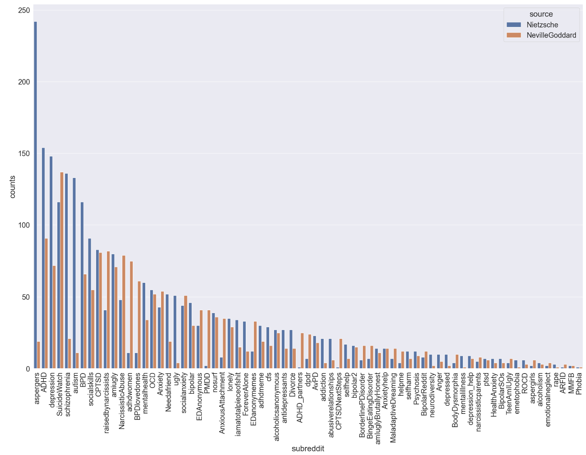

 

----

 

## Analysis

All analyses were run for each of the mental health subreddits.

**N-gram comparison:** Extracted top 10 unigrams and bigrams.

**Wordcloud comparison:** Wordclouds of unigrams and bigrams.

**Polarity:** Comparison of positive or negative sentiment score distributions.

**Subjectivity:** Comparison of subjective or objective score distribution.

**Emapth Category:** Similar to *LIWC*, *Empath* library categorizes text into topics related to emotions, cognition, work, actions etc. We compare the highest scoring Empath categories and their average values.

**NRCLex Category:** This is a library that is entirely focused on deriving emotion from a text. There are 10 emotional categories and the average values of each of these are compared.

**Verb Category Frequency:** This is derived from *Wordnet* library and extracting the logical grouping of verbs (lexnames). 

**Noun Category Frequency:** Similar to above, but for nouns.

**SFA:** It has been found that *Self-Focused Attention* can be an indicator of non-chronic depression. Comparison of the frequency of self-referential words such as “I”, “Me”, “Mine”, etc. is performed.

**Emotion Change:** Using *Linear Regression* on each of *NRCLex* and *Empath* categories, I found the change in the values in these categories over time, for each author. This comparison can give an idea of recovery/deterioration over a period of time.    

**Statistical Significance Test:** Used a non-parametric test like *Mann-Whitney U-test* to compare differences between the distributions of emotion change data between the two groups. Alpha value was set at 0.05. Both two-tailed and one tailed tests were conducted. 

**Trend:** Data starting from *January, 2019* to present is taken. I found the trend of average NRCLex values and made a time series comparison. This could give an idea of the change experienced by each of these groups as a result of the *Covid-19* situation. 

 

----

 

## Mental Health Subreddits

ADHD, depression, BPD, socialskills, SuicideWatch, CPTSD, raisedbynarcissists, NarcissisticAbuse, OCD

 

----

 

Expand ADHD

## ADHD

**Brief:** ADHD is one of the most common neurodevelopmental disorders of childhood. It is usually first diagnosed in childhood and often lasts into adulthood. Children with ADHD may have trouble paying attention, controlling impulsive behaviors (may act without thinking about what the result will be), or be overly active.

**Nietzsche:NevilleGoddard posts:** 155:90

**Analysis:**

ADHD Polarity | ADHD Subjectivity
:-------------------------:|:-------------------------:
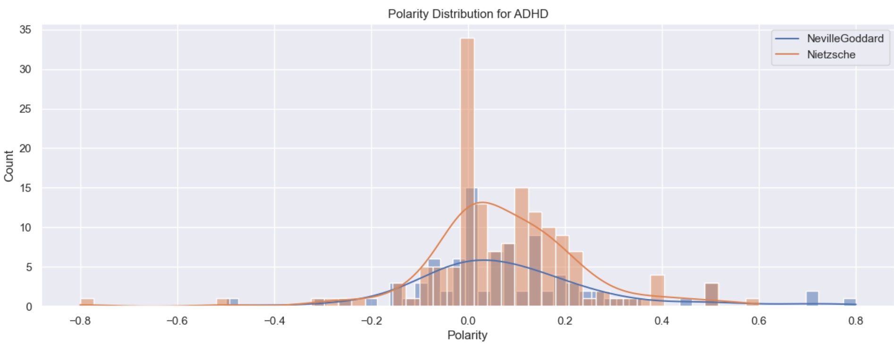  |  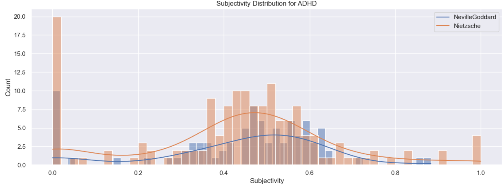

- Polarity scores for NevilleGoddard posts seem to be balanced between positive and negative sentiments. 
- On the other hand, Nietzsche posts are skewed towards positive sentiments. 
- When it comes to Subjectivity, NevilleGoddard posts seem to be more subjective.

 

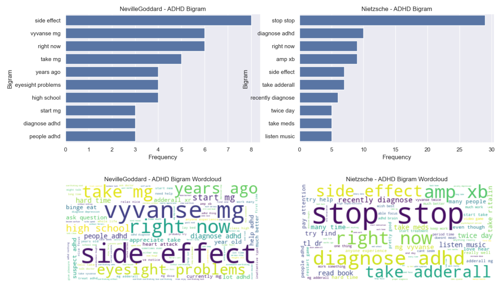 

- Looking at Empath category plots, there’s more talk of health in NevilleGoddard forums, perhaps regarding use of drugs (“Vyvanse mg”, “Adderall”, “mg”) for ADHD. This can be corroborated from comparing the N-grams and Wordclouds from these communities. 
- Average negative emotion and average positive emotion tend to be less for Nietzsche posts than their respective values from NevilleGoddard. This indicates less emotional posts, or, perhaps a less subjective post which is corroborated from Subjectivity comparison.
- There is a higher chance of encountering positive talks of “giving” and “listen” in NevilleGoddard than in Nietzsche. 
- On the other hand, there is a prevalence of talks about “violence”, “nervousness” and “shame” in Nietzsche forums as compared to NevilleGoddard. Can a conclusion be drawn that Neville Goddard commenters look towards the positive aspects of life?
- Some common causes of ADHD seem to stem from topics relating to “business”, “work” and “school”. “work” and “school” talks dominate in Nietzsche forums, while “business” dominates in NevilleGoddard.

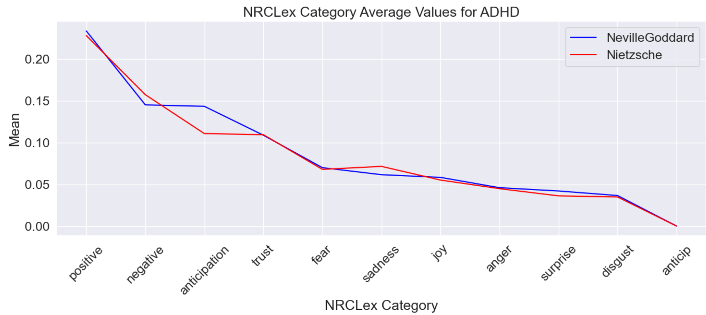 

- Let’s look at NRCLex Scores. The average results are comparable except in the category of “anticipation”. There’s more talk of anticipation for NevilleGoddard posts. This is to be expected as the very principle of Law of attraction revolves around making a wish and anticipating an outcome. It doesn’t necessarily have negative connotations (except if the posts are talking about failed expectations, in which case, there should have been a difference in “negative” scores which is not observed here).

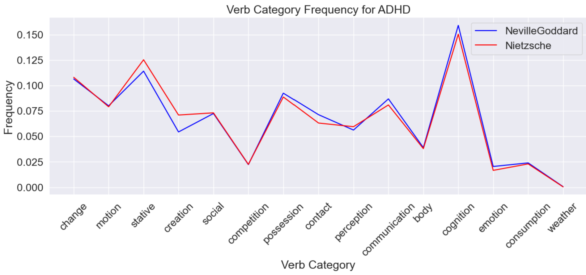 

- Looking at Verb category, differences in “stative” and “creation” categories are observed. 
- For Noun Categories, a difference in “time”, “act” and “cognition” is observed. 
- NevilleGoddard has a higher “time” frequency, which could show that there’s more talk about temporal relations. A possible reason could be that users are talking about an event in the past. Is it possible that there has been a recovery, a before-after story? 
- “cognition” dominates in case of Nietzsche. This denotes talks regarding cognitive processes such as thinking, judging, analyzing, doubting etc. 
- “act” dominates as well, which denotes words of action. Can we assume that this points to a more practical attitude?

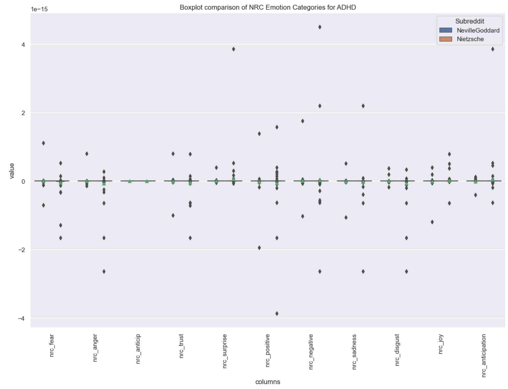 

- Emotion change is observed for each of the users for the empathy and NRCLex categories and the change distributions are compared between the two subreddits using Mann-Whitney U-test.
- The number of valid data points are not large enough to give a conclusive difference between any of the variables that seem to have high statistical significance. So we compare the means of more frequently occurring emotions data such as NRCLex values.
- From the boxplots, fear, anger, disgust has seen an increase on an average for NevilleGoddard. 
- The opposite change is observed for Nietzsche. A decreasing sadness and negative trend is observed from Nietzsche. 
- An increase in ‘positive’, ‘surprise’ and ‘joy’ is observed for Nietzsche. This points to a positive overall change in relation to ADHD, a recovery. 
- This recovery is more drastic in Nietzsche forums as compared to NevilleGoddard. 

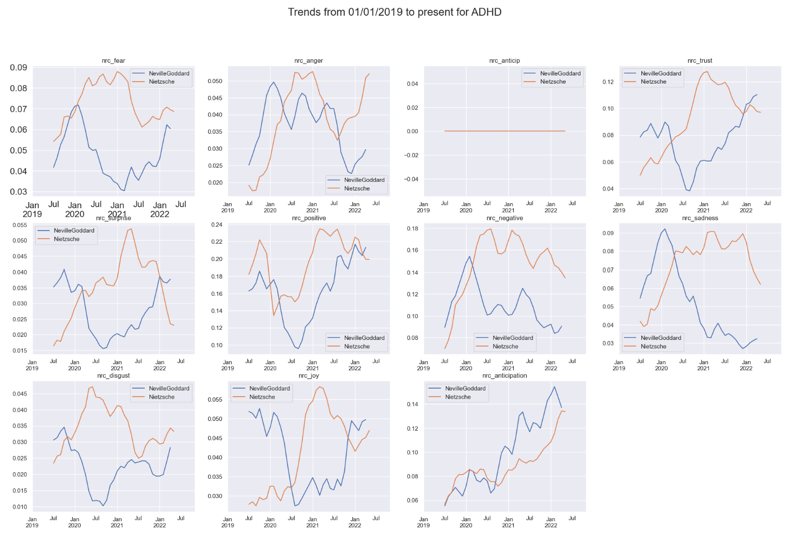 

- Next, we look at the impact of COVID19 on the emotions evoked form these posts. A stark difference in ‘fear’, ‘anger’, ‘trust’, ‘surprise’, ‘negative’, ‘sadness’, ‘disgust’, ‘joy’ is observed. 
- It’s interesting to note that Nietzsche posts experienced a drastic increase in negative emotions after January, 2020 while the opposite effect is observed for NevilleGoddard. 

**Conclusion:** One can say that the recovery experienced by Nietzsche posts has been more drastic. These forums tended to have a dominance of negativity as compared to NevilleGoddard. Covid19 seems to have had a more pronounced effect on Nietzsche posts than NevilleGoddard posts. 

Expand OCD

## OCD: Obsessive-compulsive disorder (OCD) features a pattern of unwanted thoughts and fears (obsessions) that lead you to do repetitive behaviors (compulsions). These obsessions and compulsions interfere with daily activities and cause significant distress.

**Brief:**

**Nietzsche:NevilleGoddard posts:** 55:50
  
**Analysis:**

 

- From bigram counts, it is very obvious that the posts from NevilleGoddard have a lot of mentions of the law of attraction which is not related to the mental health concern of OCD.

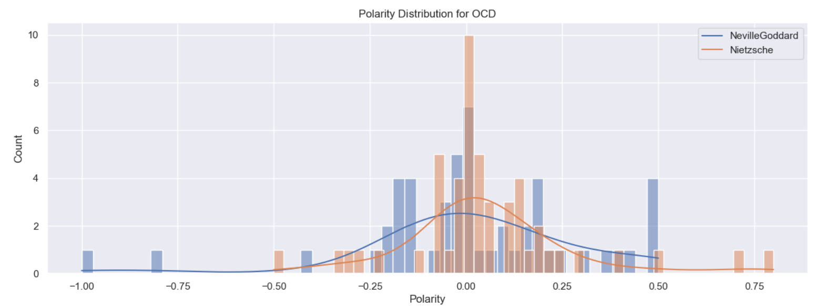 

- NevilleGoddard posts have a slight tendency towards negative polarity.

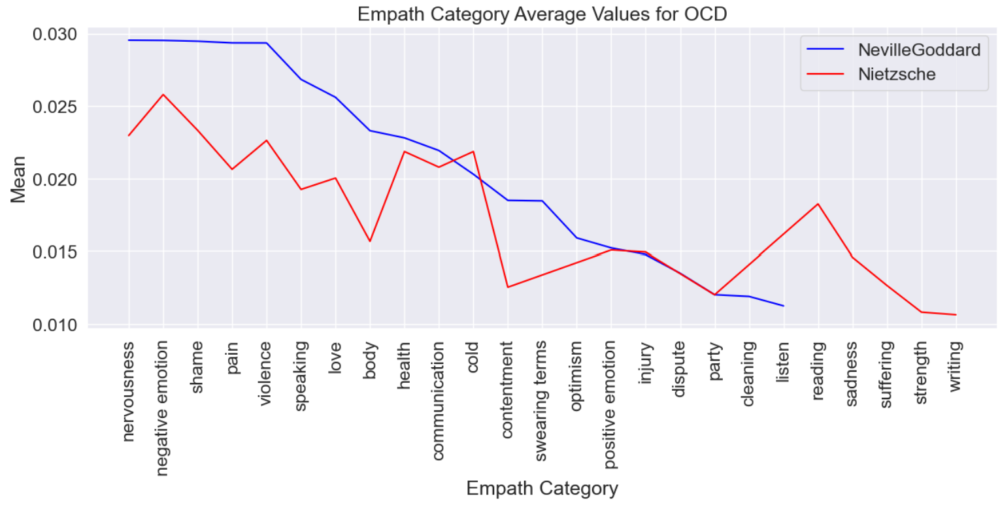 

- Tendency towards negative polarity is supported by the dominance of negative empath categories in Nevillegoddard posts (nervousness, negative emotion, shame, pain, violence). 

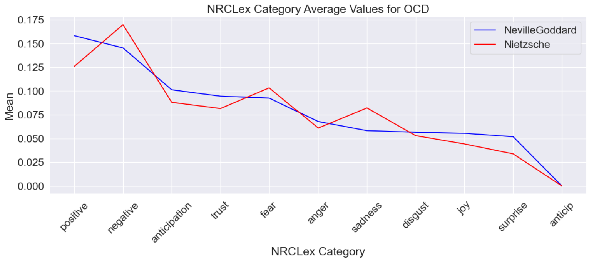 

- A different picture is seen in NRCLex category average values. Nietzsche posts have higher negativity, fear and sadness.

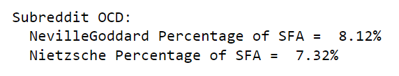 

- SFA is 8.12% for NevilleGoddard and 7.32% for Nietzsche. This is a stark difference. Higher SFA values are associated with depression.

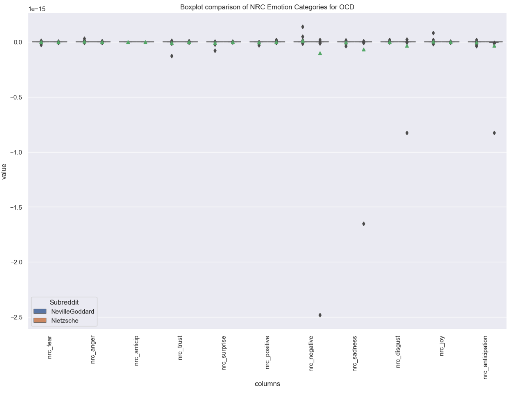 

- An increase in joy is observed for NevilleGoddard. 
- There has been an increase in negative emotions for NevilleGoddard. 
- The changes for Nietzsche are more or less the same. 

 

- As a response to Covid19, Nietzsche posts show a greater value for all emotion categories, positive or negative. 

**Conclusion:** Since the results are ambiguous, no belief system is found to help the cause of OCD.

  

Expand SuicideWatch

  

## SuicideWatch:

**Brief:** Peer support for anyone struggling with suicidal thoughts.

**Nietzsche:NevilleGoddard posts:** 112: 137

**Analysis:**
  
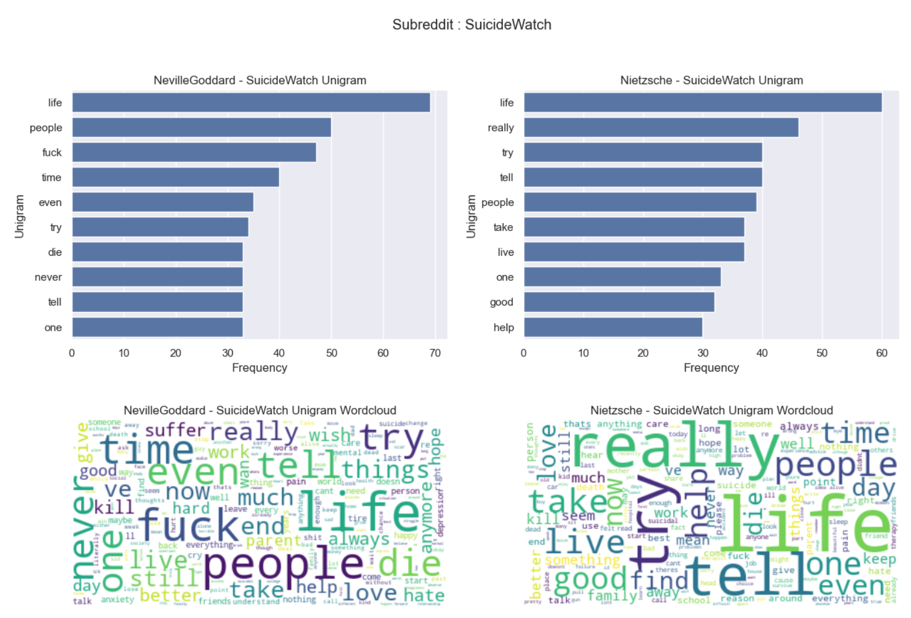 

- It is surprising that the word “die” which is expected to be prevalently used for a suicide forum doesn’t make it to the top 10 list of Nietzsche posts.

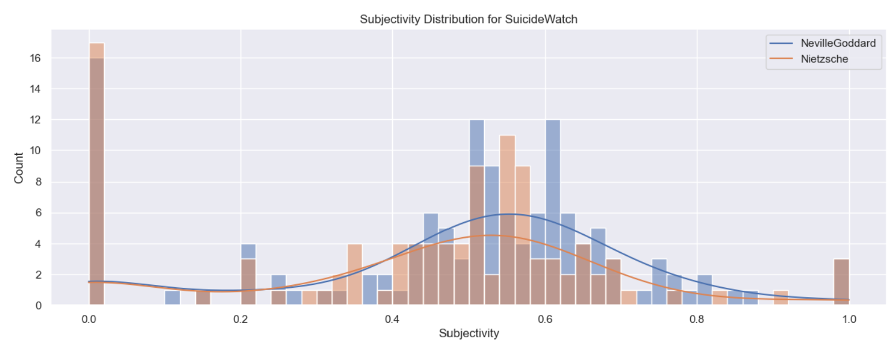

- As usual, NevilleGoddard posts are slightly more subjective.

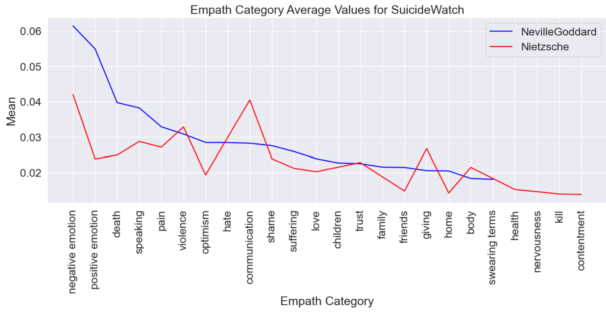 

- Not much emotionality is observed in Nietzsche forums. 
- This is derived from the dominance of ‘communication’ Empath category for Nietzsche and dominance of ‘positive emotion’ and ‘negative emotion’ for NevilleGoddard. - - There seems to be more talk of death in NevilleGoddard posts.

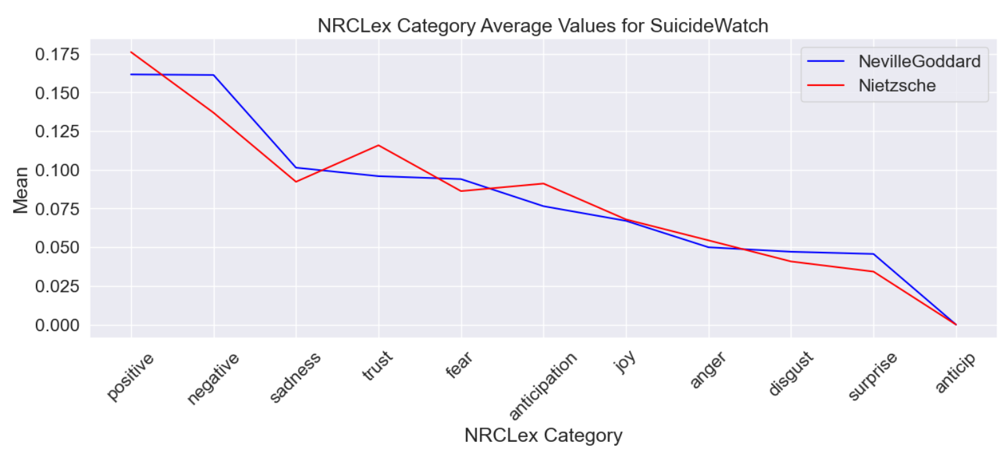 

- NRCLex categories clearly show that Nietzsche posts are generally more positive than NevilleGoddard ones (more positive, more trust, less negative, less sadness, less fear).

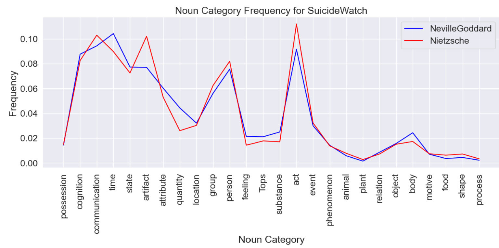 

- It is interesting to note an higher usage of artifact (man-made objects) nouns in Nietzsche posts. 

 

- Since we have enough datapoints to measure statistical significance test between emotion change in NRC emotions, it is found that NevilleGoddard posts seem to have significantly greater increase in negative emotion than Nietzsche posts ( p = 0.03). This is seen from the one tailed Mann-Whitney U test with alpha=0.05. Thus we reject the null hypothesis that says that the samples come from the same distribution.

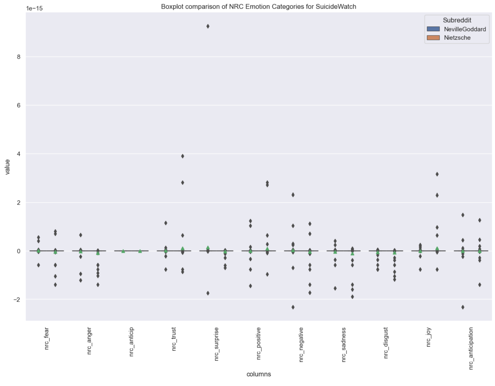 

- For Nietzsche posts, a clear decrease in negative, surprise, anger, sadness, disgust  and an increase in positive and joy is observed. 
- NevilleGoddard changes are ambiguous except anger, disgust and joy. 
- All 3 show a negative change, which could show a diminishment of emotionality overall.

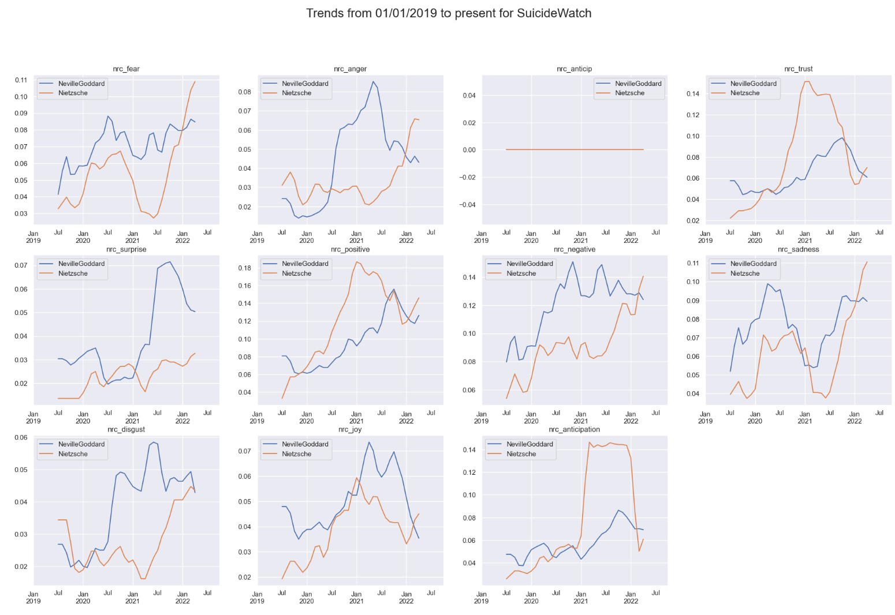 

- Covid19 reactions are mostly negative for NevilleGoddard posts as compared to Nietzsche posts. 

**Conclusion:** Again, Nietzsche posts show a clear improvement in SuicideWatch forum while NevilleGoddard posts are ambiguous.

  

Expand Depression

  
  
## Depression:

**Brief:** Depression is a mood disorder that causes a persistent feeling of sadness and loss of interest. Also called major depressive disorder or clinical depression, it affects how you feel, think and behave and can lead to a variety of emotional and physical problems. You may have trouble doing normal day-to-day activities, and sometimes you may feel as if life isn't worth living.

**Nietzsche:NevilleGoddard posts:** 145:70

  
**Analysis:**
  
  
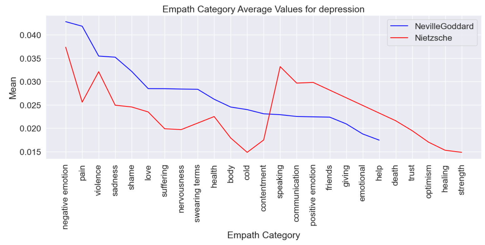 

- When it comes to Empath Average Values, NevilleGoddard dominates in the emotion department (negative emotion, pain, violence, sadness, shame, love, suffering, nervousness, swearing terms). This is surprising as the polarity distributions looked similar. 
- On the other hand, Nietzsche forum dominates in positive emotions such as speaking, communication, positive emotion, friends, giving, etc. 
- There is a clear difference in the emotion distribution between the two subreddits, with Nietzsche tending towards the positive side.

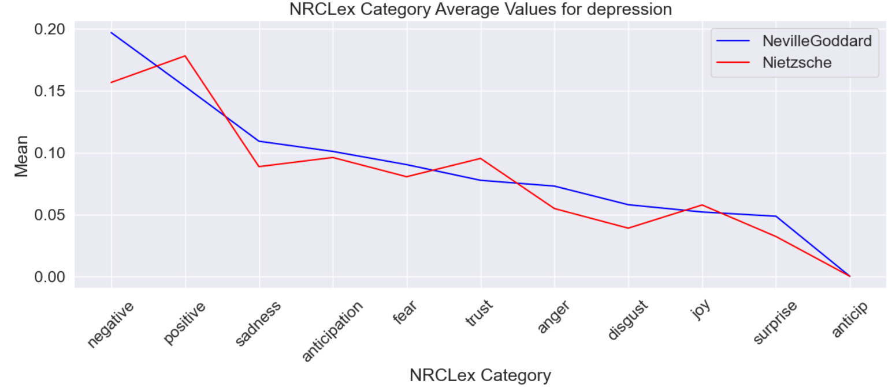 

- For NRCLex, there is a clear dominance of positive emotions (positive, trust, joy) in Nietzsche and a dominance of negative emotions for NevilleGoddard. 
- This is similar to the Empath Category trend observed above.

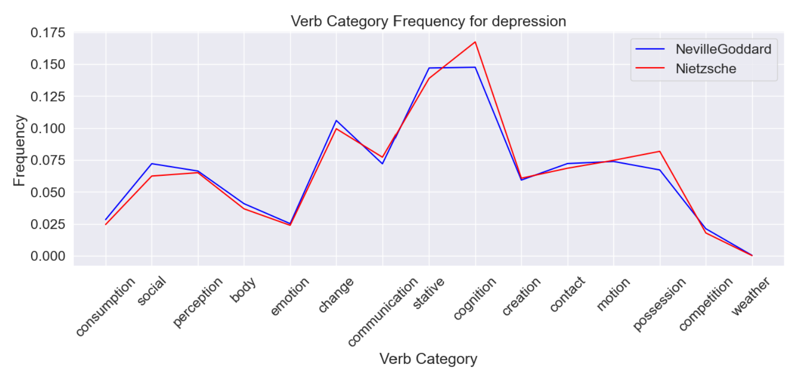 

- Cognition has a higher frequency of usage in Nietzsche. This shows a leaning towards posts being on the rational side as compared to NevilleGoddard.

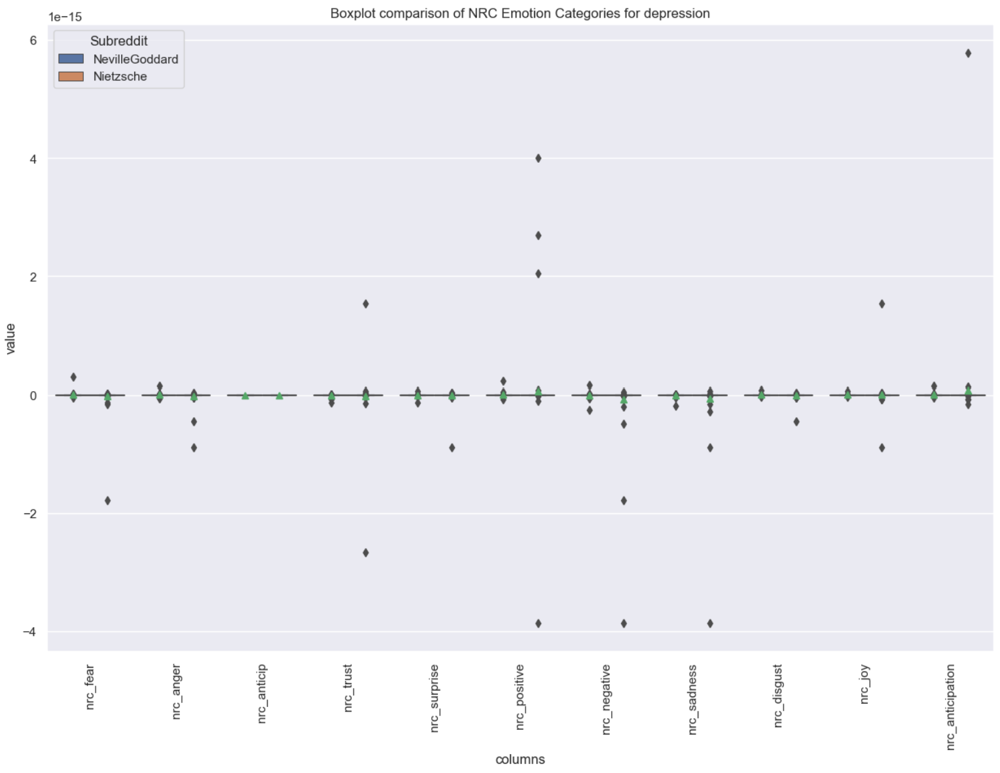 

- Coming to emotion change over time, while no clear increasing trend is observed in NRC categories, it is observed that for negative emotions (fear, anger, negative, sadness, disgust, anticipation) there has been a negative trend for Nietzsche. 
- Like the observation from ADHD, we see drastic improvements for Nietzsche while this is not observed in NevilleGoddard.

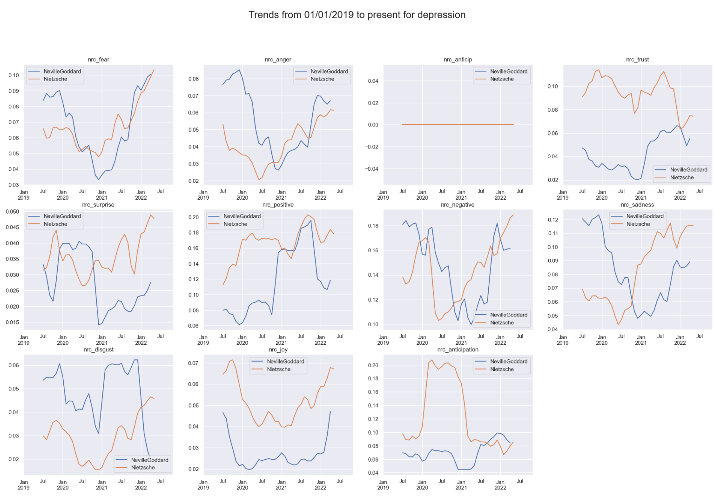 

- Responses to Covid19 is similar for both the subreddits except Anticipation. 
- Covid19 seems to have caused a greater anticipation for Nietzsche posts than NevilleGoddard.

**Conclusion:** For depression, everything indicates to Nietzsche being a healthier belief system than NevilleGoddard.

  

Expand BPD

  
  
## BPD:

**Brief:** Borderline personality disorder is a mental illness that severely impacts a person's ability to regulate their emotions. This loss of emotional control can increase impulsivity, affect how a person feels about themselves, and negatively impact their relationships with others.

**Nietzsche:NevilleGoddard posts:** 112: 62

  
**Analysis:**
  
BPD Polarity | BPD Subjectivity
:-------------------------:|:-------------------------:
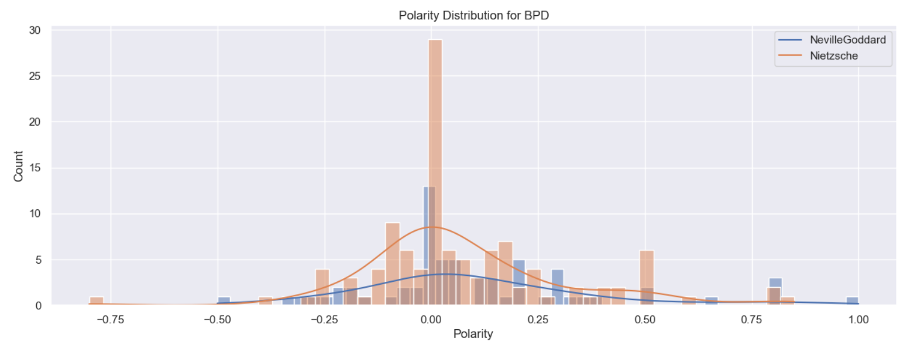  |  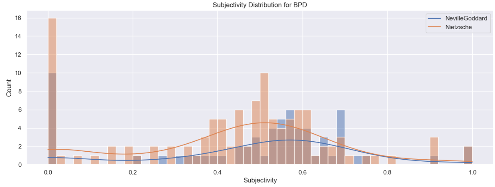

- While not much difference is observed in the distributions for Polarity, a higher subjectivity is observed in NevilleGoddard posts.

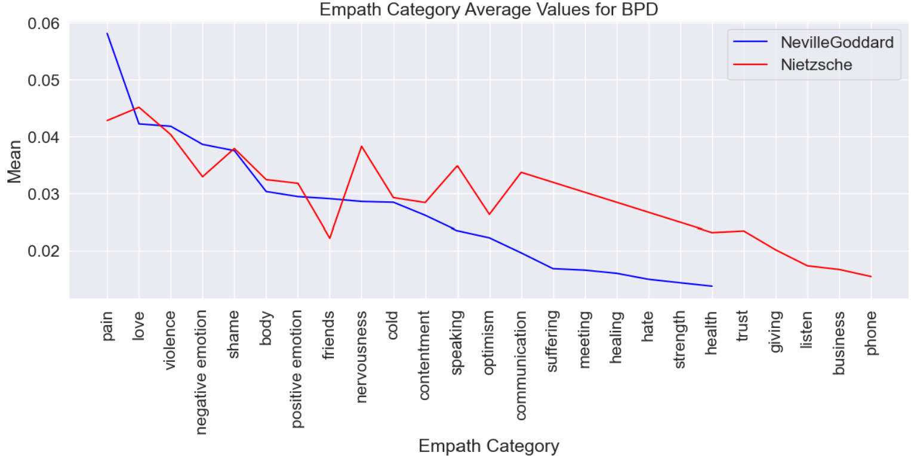 

- Empath categories point to a prevalence of negative emotions (pain, violence, negative emotion, shame) for both the subreddits. 
- However, Nietzsche has higher scores for speaking, optimism and communication. 
- Along with that, Nervousness stands out as a frequent category in Nietzsche.

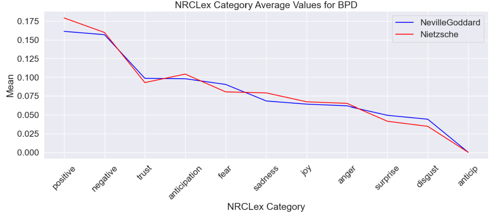 

- NRCLex scores are very similar except for ‘positive’, which is higher for Nietzsche. 

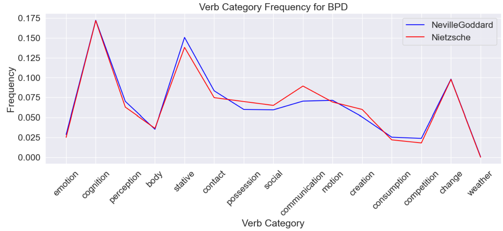 

- The same goes for Verb Category Frequency plot, with the exception of ‘communication’ that dominates for Nietzsche.

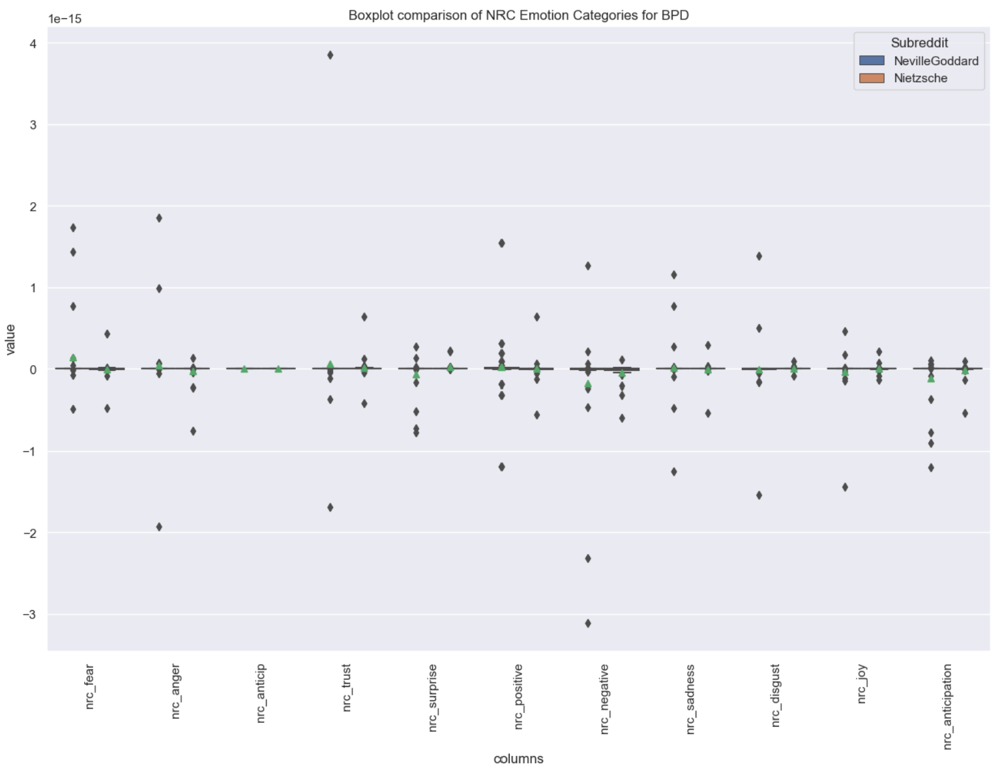 

- For NevilleGoddard posts, fear and anger seems to have increased more than Nietzsche’s posts. 
- On the other hand, a greater increase in positive and greater decrease in sadness is observed for NevilleGoddard posts. 

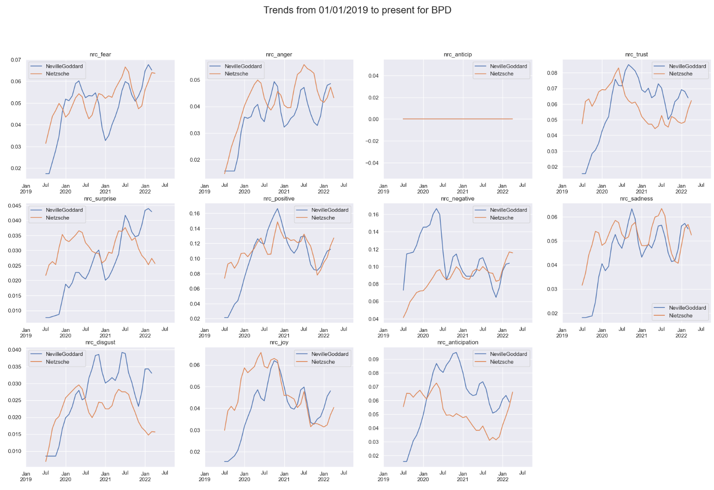 

- Covid19 responses are almost similar to each other except ‘negative’ and ‘anticipation’ categories. 
- NevilleGoddard posts had a higher negative reaction to Covid19 in both of these categories.

**Conclusion:** For BPD, it is clear that NevilleGoddard posts have a bias towards being more emotional and it seems like they have experienced drastic (but ambiguous) changes compared to Nietzsche authors. Both the belief systems have more or less similar effects on the posts of these authors. A clear recommendation is hard to make.

  

  

Expand Socialskills

  
## Socialskills:

**Brief:** A place to share your favorite social skills tips, ask for advice, or offer encouragement to others on their social skills journey. Welcome aboard!

**Nietzsche:NevilleGoddard posts:** 87:55

**Analysis:**
  
  
Socialskills Polarity | Socialskills Subjectivity
:-------------------------:|:-------------------------:
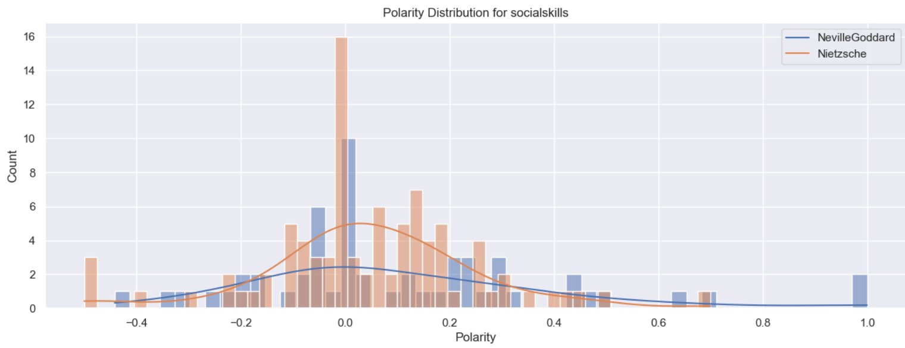  |  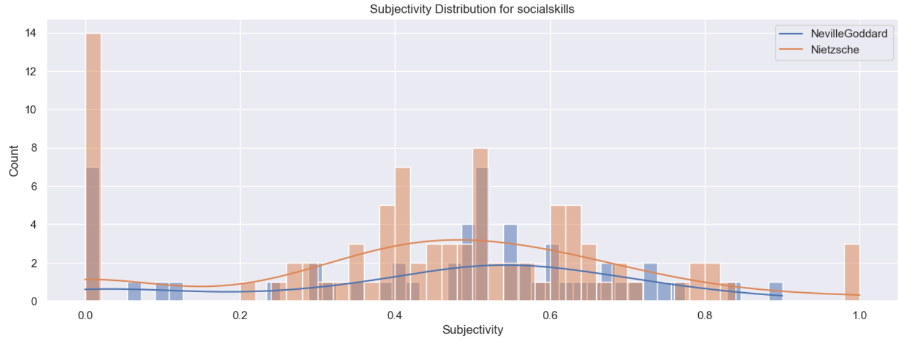

Polarity scores for Nietzsche lean slightly towards the positive and tend to be less subjective than NevilleGoddard posts.

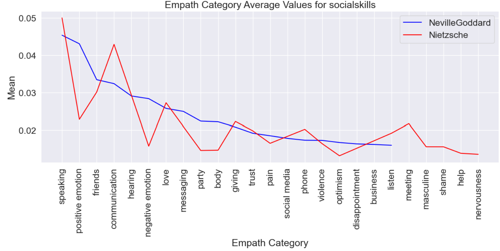 

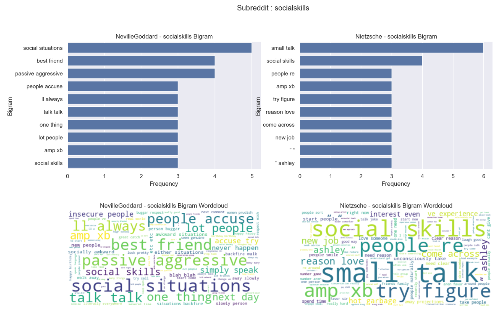 

- There is a stark difference between emotionality. 
- NevilleGoddard posts tend to have more positive and negative emotions than Nietzsche posts, pointing to a lack of emotional talk pertaining to the subject of social skills. 
- In the N-gram analysis, it is observed that Nietzsche posts focus more on the practical ways to tackle social anxiety. 
- This is due to the top two bigrams- “small talk” and  “social skills”. 
- Compare this with more subjective terms in NevilleGoddard posts such as “social situations”, “best friend”, “passive aggressive”, “people accuse”. 

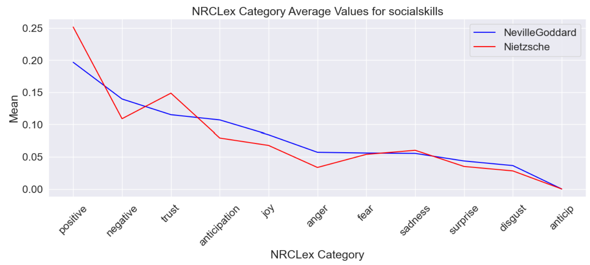 

- NRCLex ‘positive’ and ‘trust’ categories are found to be higher in Nietzsche posts. 
- “negative” is higher for NevilleGoddard posts, and so is “anticipation”, “joy”, “anger” etc. 
- This points to a greater emotionality in NevilleGoddard posts.

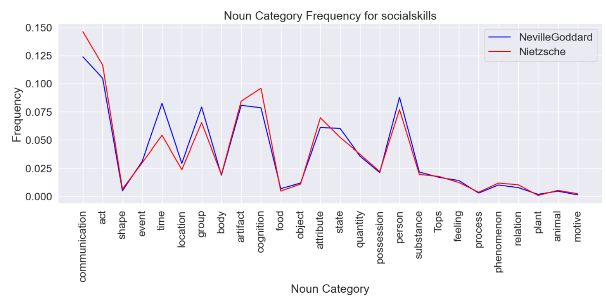 

- Verb category frequencies are almost similar, except for a higher ‘communication’ score for Nietzsche, as usual. 
- Noun categories are very different for ‘cognition’,  ‘communication’, ‘time’ and ‘group’. 
- While we see a higher ‘cognition’ and ‘communication’ values for Nietzsche (as usual), ‘time’ and ‘group’ values dominate for NevilleGoddard. 
- It is hard to tell why. Perhaps NevilleGoddard posts draw more from past experiences?   

 

- A drastic change in positive emotions is observed for NevilleGoddard posts. 
- Negative emotions of anger, negative, sadness, disgust has increased while positive emotions of trust, surprise, positive and joy has seen a decrease. 

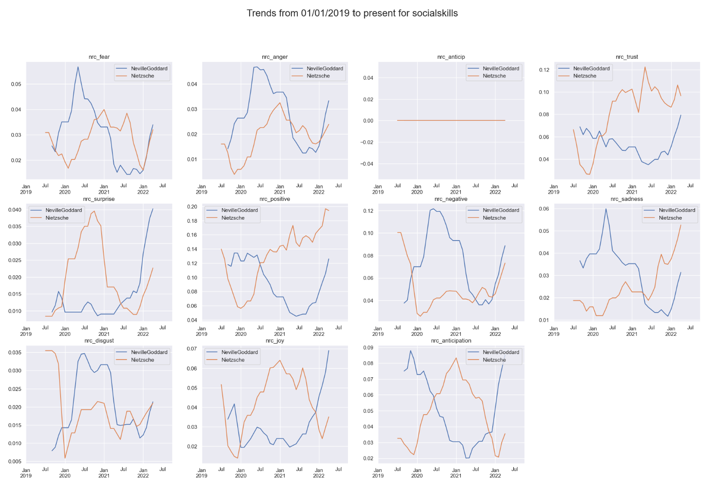 

- From Covid19 reactions, it is clear that Nietzsche posts have a tendency for increased positivity. 

**Conclusion:** It is very clear that Existentialism fares better when it comes to social anxiety.

  

  

Expand CPTSD

## CPTSD:

**Brief:** Complex post-traumatic stress disorder (complex PTSD, sometimes abbreviated to c-PTSD or CPTSD) is a condition where you experience some symptoms of PTSD along with some additional symptoms, such as: difficulty controlling your emotions. feeling very angry or distrustful towards the world.

**Nietzsche:NevilleGoddard posts:** 82:80

  
**Analysis:**
  
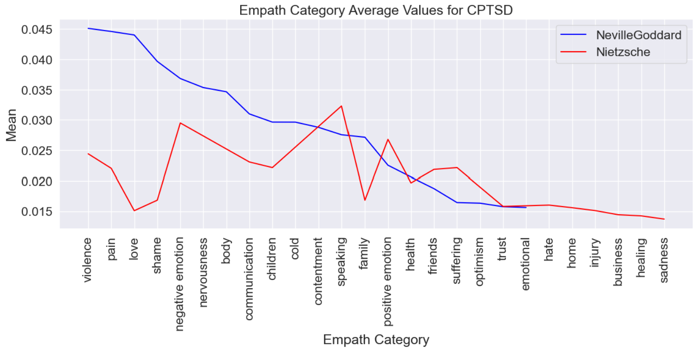 

- There is a clear dominance of negative emotions in NevilleGoddard posts with top scoring categories violence, pain, love, shame, negative emotion, body. 
- Positive emotion and speaking are higher for Nietzsche posts. 

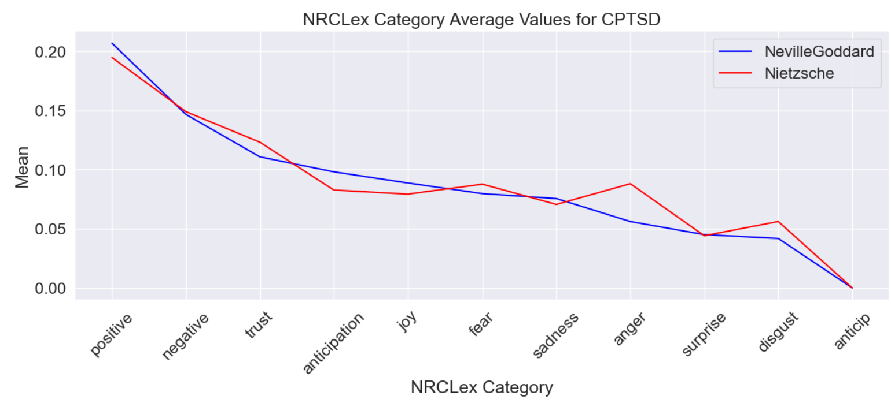 

- NRCLex average categories are similar except higher scores of anger and disgust for Nietzsche posts.

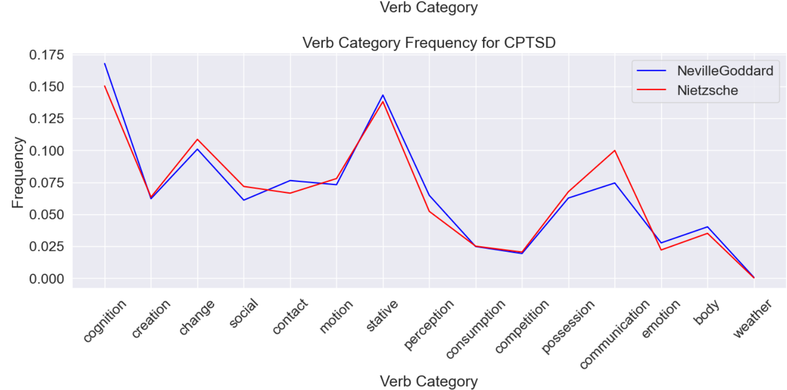 

- As usual, we find a greater value for communication in verb category for Nietzsche posts.

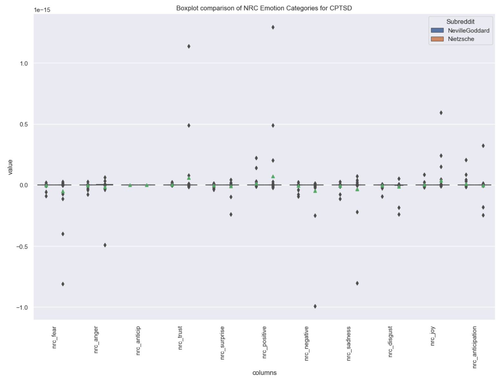 

- Both the subreddits experience similar change in emotions (for the better, a recovery). 
- However, changes for Nietzsche seem to have greater variances than NevilleGoddard posts. 

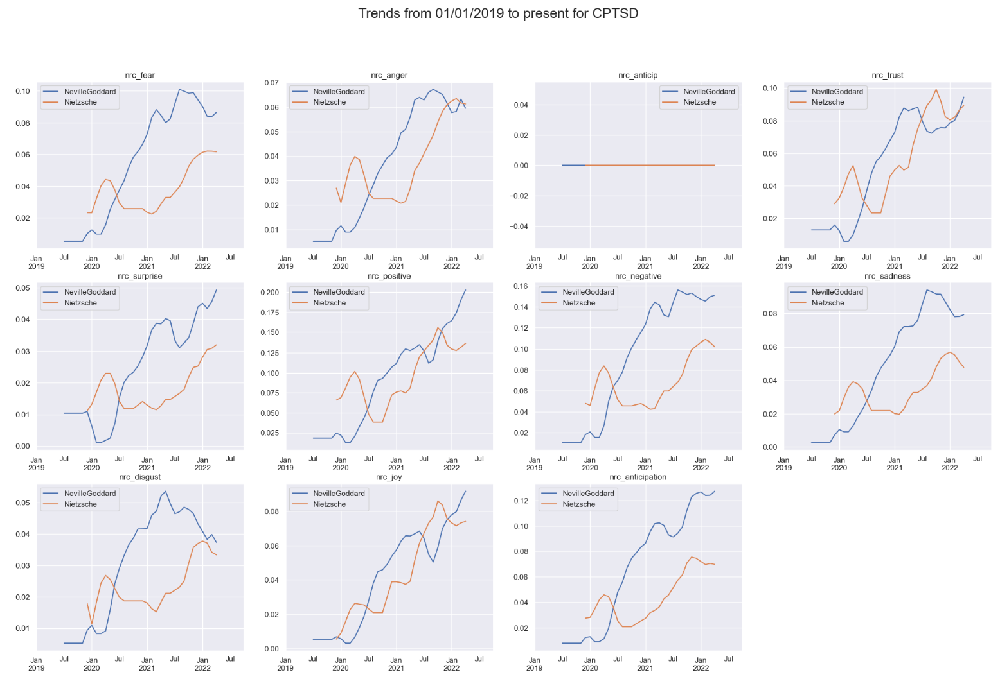 

- NevilleGoddard posts have a greater value for negative emotions as a response to Covid19 but similar reactions to Nietzsche posts for positive emotions.

**Conclusion:** There’s no clear recommendation of a belief system for CPTSD sufferers.
 
  

  

Expand Raisedbynarcissists

  

## Raisedbynarcissists:

**Brief:** This is a support group for people raised by abusive parents (with toxic, self-absorbed or abusive personality traits, which may be exhibited by those who suffer from cluster B personality disorders). Please share your stories, your questions, your histories, your fears and your triumphs. Significant others and friends are all welcome.

**Nietzsche:NevilleGoddard posts:** 40:80

**Analysis:**
  
  
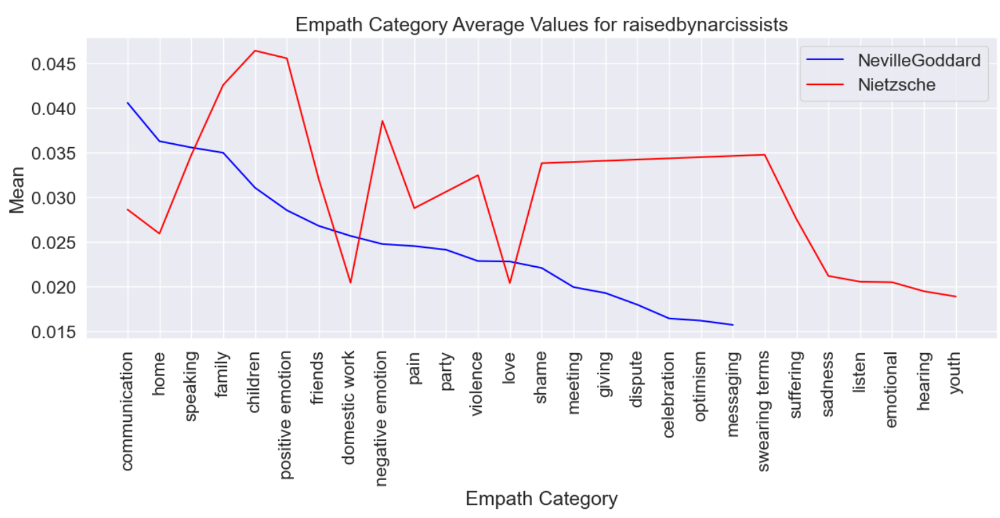 

- There is a clear dominance of negativity in Nietzsche posts over NevilleGoddard posts (positive emotion, negative emotion, pain, shame, dispute, swearing terms, suffering)

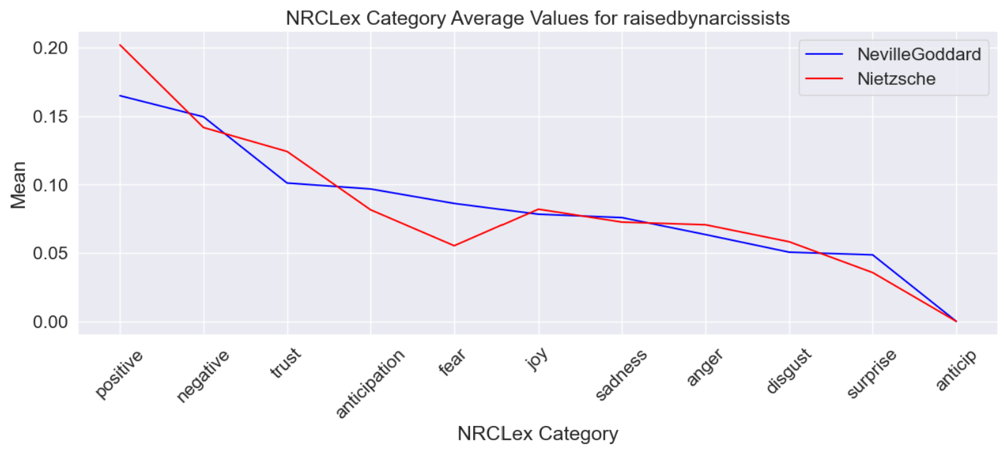 

- In NRCLex Category average plot, Nietzsche posts tend to have greater positive and trust scores and lesser negative and fear scores. 

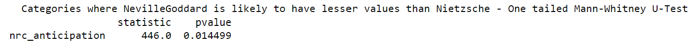 

- Anticipation change is statistically significant (p = 0.01). 
- NevilleGoddard posts have a lesser change in anticipation than Nietzsche posts. 

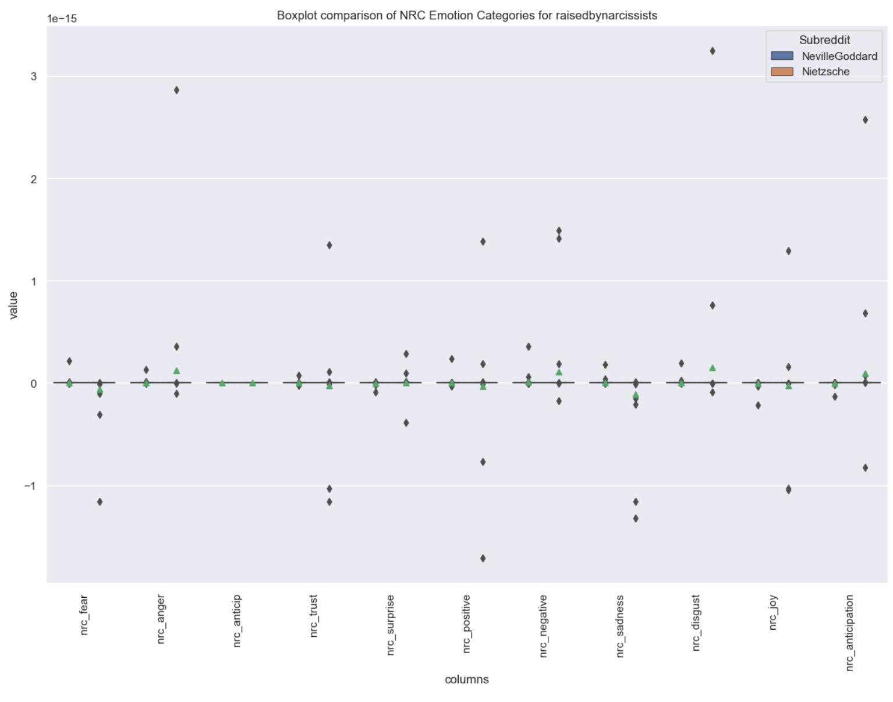 

- From the boxplot, we observe that the change is towards a decrease in anticipation for NevilleGoddard posts, and the opposite for Nietzsche posts. 
- Another opposite trend is fear. Fear decreases for Nietzsche and doesn’t for NevilleGoddard. 
- Negativity increases for Nietzsche posts but sadness decreases. 
- From the observations so far, it is hard to point at a recovery pattern for Nietzsche posts. 
- However for NevilleGoddard posts, the positives decrease and negatives increase. 

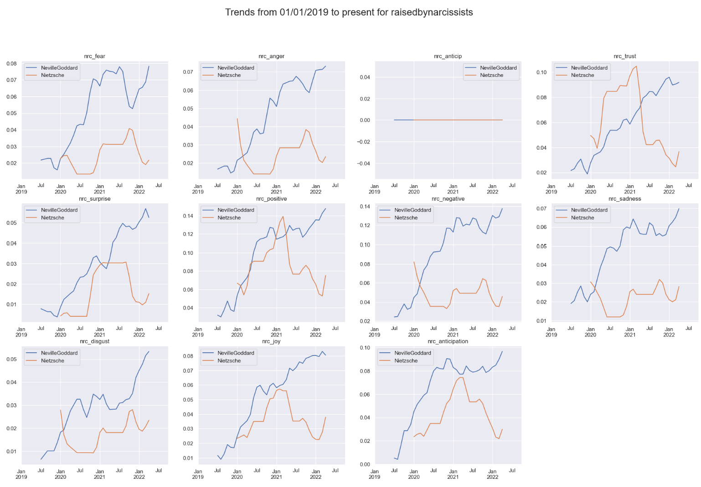 

- As usual, NevilleGoddard posts tend to score higher in negative emotion categories and similar to Nietzsche in positive emotions. 

**Conclusion:** NevilleGoddard posts score better for this forum overall

  

  

Expand NarcissisticAbuse

  
## NarcissisticAbuse:

**Brief:** This is a place for victims of narcissistic abuse to come together to support, encourage, learn from, share with, and validate one another. It is NOT a replacement for therapy or counseling. We support abusive relationships from romance, work, roommates & friends. No family content except for you, your partner/ex & your children (no abusive kids). All others will be removed including mentions like family/friends or childhood content. No demands to explain our rules or "just curious" requests.

**Nietzsche:NevilleGoddard posts:** 47: 75

  
**Analysis:**
  
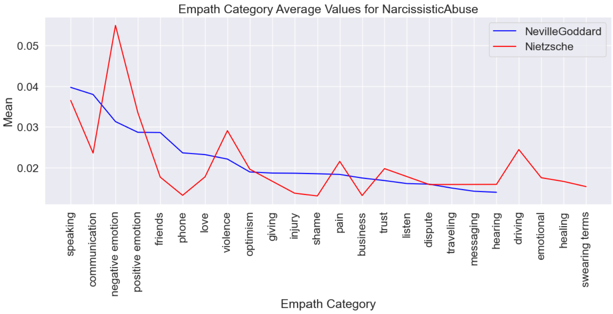 

- Nietzsche posts have a dominance of negative emotions over NevilleGoddard posts.

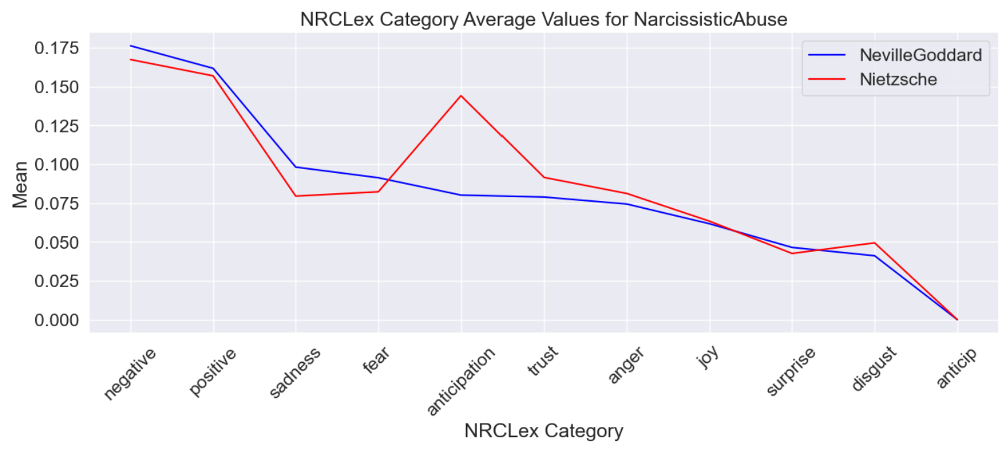 

- But for NRCLex average values, Nietzsche posts tend to have a much greater anticipation value and slightly lesser sadness and fear values.

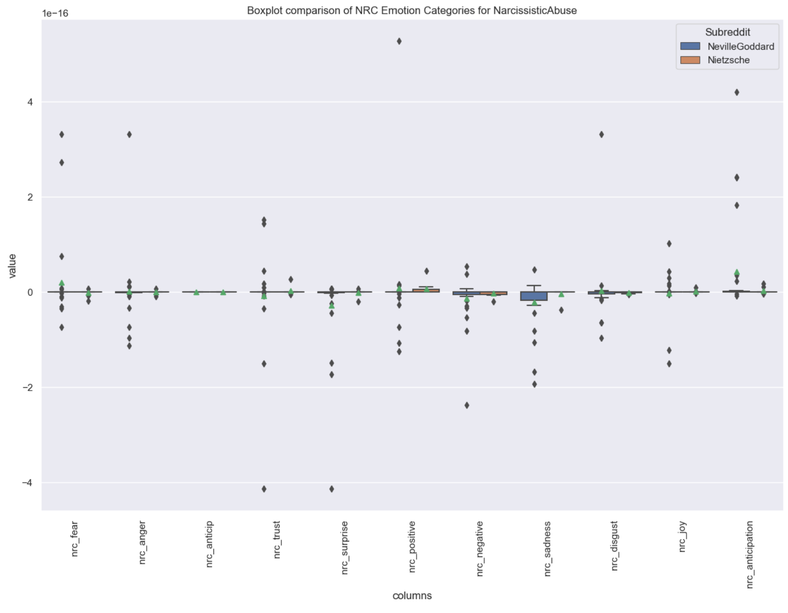 

- NevilleGoddard posts show a tendency to recovery, as seen from decreasing fear, anger, surprise, negative, sadness, disgust. 
- Anticipation shows an increase. 
- Nietzsche emotions don’t show greater changes than NevilleGoddard’s. So it is safe to assume that the belief system of NevilleGoddard serves this case better. 

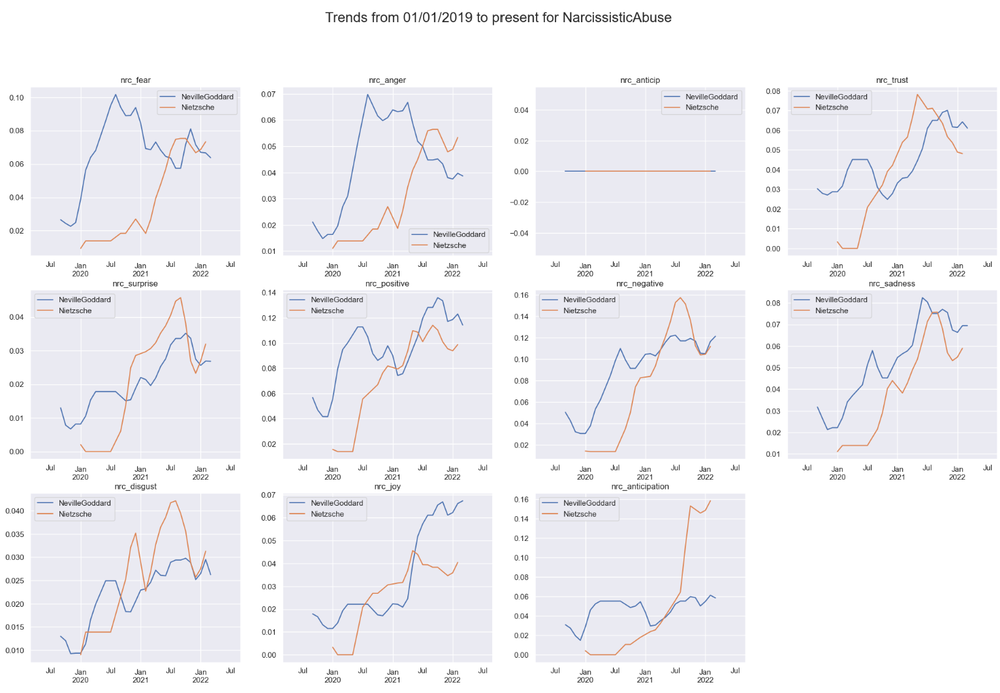 

- The improvement for NevilleGoddard posts is corroborated in the Covid19 plots
- Except for fear and anger, where NevilleGoddard posts show a starkly greater value, all other values are more or less similar to Nietzsche’s

**Conclusion:** Seems like NevilleGoddard authors make a greater improvement in this forum

## Results:

- In general, r/Nietzsche tended to have a greater percentage of negative polarity in their posts
- Posts from r/Nietzsche almost always tended towards less subjectivity
- r/Nietzsche tended to contain more words related to cognition while r/NevilleGoddard dominated in words related to emotions
- Users that subscribed to the belief system of Existentialism seem to have a greater improvement across most of the mental health subreddits that have been examined here.
- Exceptions are Narccissisism forums, where NevilleGoddard posts showed greater improvements 

----

 

## Limitations

-	The change in emotions data had very few points that had non-zero values. This is the reason why statistical significance tests gave erroneous results. A larger dataset with more authors will be needed.
-	*r/NevilleGoddard* is a small subreddit. A larger subreddit revolving around this concept is *r/lawofattraction*.
-	Similarly, *r/Nietzsche* is a smaller subreddit compared to *r/Existentialism*. 

 

----

 

## Future Work

-	Due to time constraints, I could only scrape data from smaller communities of the respective philosophical approaches. The larger reddit community revolving around the topic of law of attraction is *r/lawofattraction*. It has a total of 240K members. On the other hand, the subreddit around Nietzsche’s philosophy is *r/Existentialism* with 145K members. I’m currently scraping both of these subreddits for a more thorough comparison between these starkly different philosophies. This work can be expanded to compare effects of other different philosophies such as *Stoicism, Pessimism, Hermetic Principles, Atheism, New Age, Zen, Buddhism, etc.*
-	Train a *Huggingface* model on *Go* dataset for emotion classification of reddit texts.
-	Further analysis can be conducted by hand-made *lexicons* specific to different mental health groups.
-	Conduct analysis on a group of similar subreddits rather than individual subreddits.

